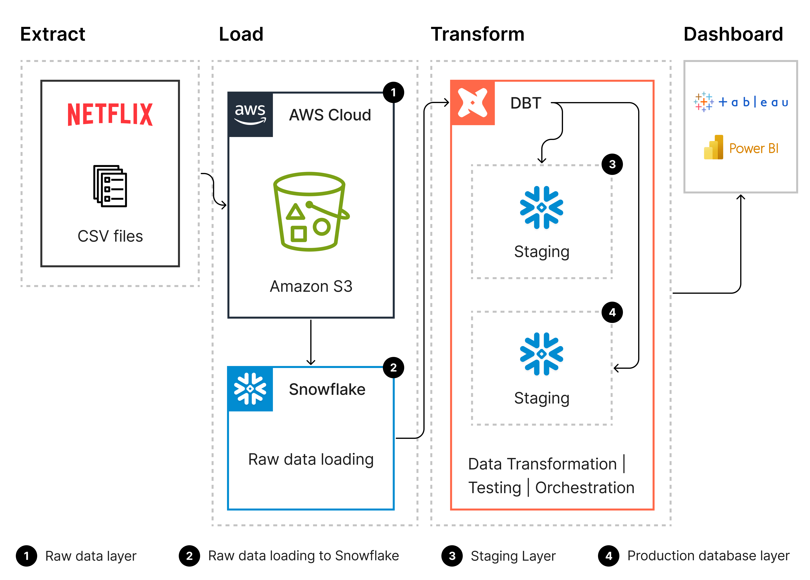

# 📊 Netflix DBT Data Pipeline Project

> **A modern, cloud-native data pipeline for Netflix analytics, leveraging AWS for scalable storage, Snowflake for powerful warehousing, and dbt for robust data transformation. Effortlessly turn raw CSV data into actionable insights with automated, version-controlled workflows.**

This project demonstrates a complete modern **ELT (Extract, Load, Transform)** pipeline built around cloud-native tools and designed for efficient, scalable data processing and analytics.

---

## 🔁 Pipeline Overview



### 🔹 1. Extract & Load
- **Source**: Netflix movie metadata (CSV format)
- **Storage**: Raw data uploaded to **Amazon S3**
- **Load**: Data ingested into **Snowflake** via external staging

### 🔹 2. Transform (with dbt)
- **dbt** manages all transformation logic using:
  - `Staging` layer for initial cleaning and typing
  - `Development` layer for modeling business logic
  - Testing, documentation, and version control
- All transformation happens **within Snowflake** for performance

### 🔹 3. Visualization & Reporting
- Transformed data is connected to BI tools:
  - **Power BI**
  - **Tableau**
  - **Looker Studio**
- These tools are used for building interactive dashboards and business insights

---

## 🚀 Project Overview
- **dbt**: Analytics engineering framework for transforming data in your warehouse
- **Warehouse**: Snowflake (configurable)
- **Dockerized**: Run anywhere, no local Python setup required

---

## 📦 Project Structure
```
.
├── Dockerfile              # Docker image definition
├── docker-compose.yml      # Docker Compose configuration
├── requirements.txt        # Python dependencies
├── profiles.yml            # dbt profiles configuration (Snowflake)
├── .dockerignore           # Files to exclude from Docker build
├── env.example             # Example environment variables
├── netflix/                # dbt project directory
│   ├── models/
│   ├── tests/
│   ├── macros/
│   ├── seeds/
│   └── dbt_project.yml
└── README.md               # This file
```

---

## 📁 dbt Folder Structure Explained

Your `netflix/` directory follows the standard dbt project structure. Here's what each key folder/file is for:

| Folder/File         | Purpose                                                                 |
|---------------------|-------------------------------------------------------------------------|
| `models/`           | Main dbt models (SQL transformations). Contains subfolders for dimensions (`dim/`), facts (`fct/`), marts (`mart/`), and staging (`staging/`). |
| `analyses/`         | Ad-hoc analysis SQL files not part of the main model DAG.               |
| `macros/`           | Custom Jinja macros (reusable SQL snippets/functions).                  |
| `seeds/`            | Static CSV data to load as tables (e.g., reference data).               |
| `snapshots/`        | Snapshot SQL files for tracking changes to records over time.           |
| `tests/`            | Custom data tests to ensure data quality.                               |
| `logs/`, `target/`  | dbt output and compiled files (not usually committed to git).           |
| `dbt_project.yml`   | Main configuration file for your dbt project.                           |
| `packages.yml`      | Lists dbt packages (like `dbt-utils`) your project depends on.          |
| `README.md`         | Project documentation.                                                  |

**This structure helps you organize your analytics code, keep transformations modular, and ensure data quality and documentation are built-in.**

---

## 🏁 Quick Start

### 1. Clone the repository
```sh
git clone <repo-url>
cd Netflix-proj-1
```

### 2. Set up environment variables
```sh
cp env.example .env
# Edit .env with your Snowflake credentials
```

### 3. Build and run with Docker Compose
```sh
docker-compose build
docker-compose up dbt-netflix
```

### 4. Run dbt commands
- Run all models: `docker-compose up dbt-netflix`
- Run tests: `docker-compose up dbt-test`
- Run specific model: `docker-compose run --rm dbt-netflix dbt run --select <model_name>`
- Open shell: `docker-compose run --rm dbt-netflix bash`

---

## ⚙️ Configuration
- **Snowflake credentials**: Set in your `.env` file
- **dbt profiles**: Configured in `profiles.yml` (uses environment variables for secrets)
- **dbt packages**: Managed in `netflix/packages.yml` (e.g., dbt-utils)

---

## 🐳 Docker Usage
- All dbt commands can be run inside the container
- For development, mount your project directory for live editing
- See `README-Docker.md` for advanced Docker usage

---

## 🧪 Testing
Run dbt tests:
```sh
docker-compose up dbt-test
```

---

## 📝 Documentation
- [dbt Documentation](https://docs.getdbt.com/)
- [Snowflake Setup](https://docs.snowflake.com/en/)
- See `README-Docker.md` for more Docker tips

---

## 🛡️ Security
- **Never commit real credentials** in `.env` or `profiles.yml`
- Use environment variables or Docker secrets for production

---

## 🤝 Contributing
Pull requests are welcome! For major changes, please open an issue first to discuss what you would like to change.